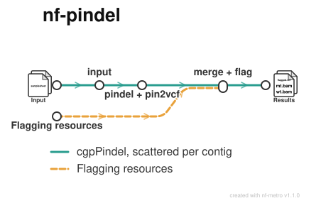

# shahcompbio/nf-pindel

[](https://github.com/shahcompbio/nf-pindel/actions/workflows/nf-test.yml)
[](https://github.com/shahcompbio/nf-pindel/actions/workflows/linting.yml)
[](https://www.nf-test.com)

[](https://www.nextflow.io/)
[](https://github.com/nf-core/tools/releases/tag/4.1.0)
[](https://www.docker.com/)
[](https://sylabs.io/docs/)

## Introduction

**shahcompbio/nf-pindel** calls and flags indels from tumour/normal BAM pairs
with [cgpPindel](https://github.com/cancerit/cgpPindel) 3.10.0.

This is the Nextflow port of the `toil_pindel` Toil pipeline. It runs the same
cgpPindel version from the same container, so results are expected to match —
see [docs/migration.md](docs/migration.md) for the one behavioural change, which
is about parallelism rather than output.

> [!NOTE]
> nf-core's `pindel/pindel` module is the **original Pindel**, a different tool
> that emits raw `_D`/`_SI` text files. cgpPindel is a Sanger reimplementation
> with its own VCF output and flagging rules, is not on bioconda and has no
> nf-core module, so this pipeline wraps cancerit's published image directly.

<p align="center">
  
</p>

### What runs

Two execution shapes for the same tool, selected by `--scatter_by_contig`.

**Scattered (default)** reproduces what `toil_pindel` got from driving
cgpPindel's `-process`/`-index` staging — one task per contig, one core each:

```
CGPPINDEL_INPUT  →  CGPPINDEL_CALL (per contig)  →  CGPPINDEL_MERGE_FLAG
```

**Unstaged** (`--scatter_by_contig false`) runs `pindel.pl` once per pair and
lets cgpPindel thread internally across `--pindel_cpus`, which is what
cancerit's own Nextflow does.

The two produce the same output — verified on the test data down to the INFO and
FORMAT fields — and neither is faster than the other, because a contig cannot be
split and the longest one is the critical path either way. They differ in
scheduling shape: many small slots versus one large one. See
[docs/migration.md](docs/migration.md).

## Usage

> [!NOTE]
> If you are new to Nextflow and nf-core, refer to [this page](https://nf-co.re/docs/get_started/environment_setup/overview)
> on how to set up Nextflow, and test your setup with `-profile test` before
> running on real data.

Prepare a samplesheet. Rows are grouped by `patient`: each needs exactly one
`status=0` normal and one `status=1` tumour.

`samplesheet.csv`:

```csv
patient,sample,status,bam,bai,bas
PATIENT_1,PATIENT_1_N,0,/data/normal.bam,/data/normal.bam.bai,/data/normal.bam.bas
PATIENT_1,PATIENT_1_T,1,/data/tumor.bam,/data/tumor.bam.bai,/data/tumor.bam.bas
```

| Column    | Description                                                             |
| --------- | ----------------------------------------------------------------------- |
| `patient` | Groups rows into one tumour/normal pair. Required.                       |
| `sample`  | Sample identifier. Required.                                             |
| `status`  | `0` for the normal, `1` for the tumour. Exactly one of each per patient.  |
| `bam`     | Aligned reads. Required.                                                 |
| `bai`     | Its index. Required.                                                     |
| `bas`     | Optional BAM statistics file, co-located with the BAM.                   |

Then run:

```bash
nextflow run shahcompbio/nf-pindel \
   -profile <docker/singularity/.../institute> \
   --input samplesheet.csv \
   --fasta /ref/genome.fasta \
   --simrep /ref/simpleRepeats.bed.gz \
   --genes /ref/gene_regions.bed.gz \
   --unmatched /ref/pindel_np.gff3.gz \
   --filter_rules /ref/genomicRules.lst \
   --species HUMAN --assembly GRCH37D5 \
   --exclude 'NC_007605,hs37d5,GL%' \
   --outdir <OUTDIR>
```

`--species` and `--assembly` are read from the BAM header when omitted.
`--badloci` is optional. Note the flagging rules differ between genomic and
targeted data — pick the right `--filter_rules` for your assay.

> [!WARNING]
> Provide pipeline parameters via the CLI or a Nextflow `-params-file`. Custom
> config files can be used to provide any configuration _except for parameters_;
> see [the nf-core docs](https://nf-co.re/docs/usage/getting_started/configuration#custom-configuration-files).

## Output

```text
<outdir>/<patient>/<tumour>_vs_<normal>.flagged.vcf.gz(.tbi)
<outdir>/<patient>/<tumour>_vs_<normal>_mt.bam(.bai)
<outdir>/<patient>/<tumour>_vs_<normal>_wt.bam(.bai)
<outdir>/<patient>/<tumour>_vs_<normal>.germline.bed
```

Names come from the BAM headers' SM tags, not the samplesheet. `--flat_publish`
drops the `<patient>/` level, reproducing the `toil_pindel` layout. See
[docs/output.md](docs/output.md).

## Credits

shahcompbio/nf-pindel was written by the [Shah lab](https://github.com/shahcompbio),
ported from `toil_pindel`.

## Contributions and Support

Contributions are welcome — see [docs/CONTRIBUTING.md](docs/CONTRIBUTING.md).

## Citations

Citations for the tools used are in [CITATIONS.md](CITATIONS.md). This pipeline
uses code and infrastructure developed by the nf-core community, reused here
under the [MIT license](https://github.com/nf-core/tools/blob/main/LICENSE):

> **The nf-core framework for community-curated bioinformatics pipelines.**
>
> Philip Ewels, Alexander Peltzer, Sven Fillinger, Harshil Patel, Johannes Alneberg, Andreas Wilm, Maxime Ulysse Garcia, Paolo Di Tommaso & Sven Nahnsen.
>
> _Nat Biotechnol._ 2020 Feb 13. doi: [10.1038/s41587-020-0439-x](https://dx.doi.org/10.1038/s41587-020-0439-x).
